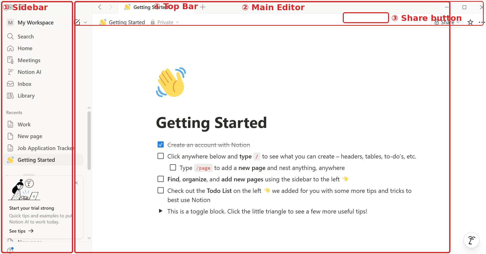
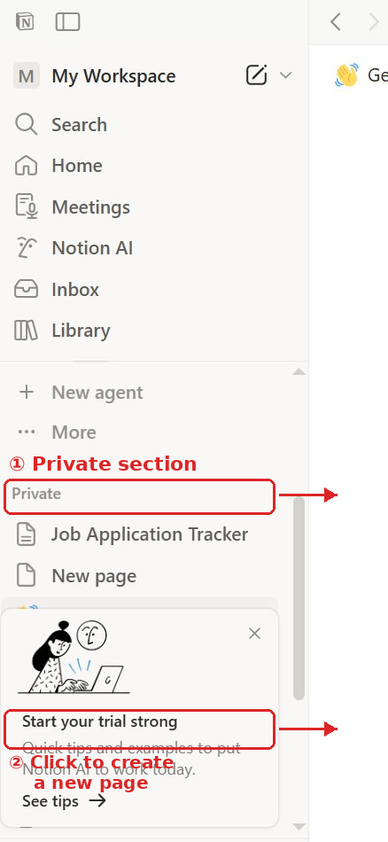
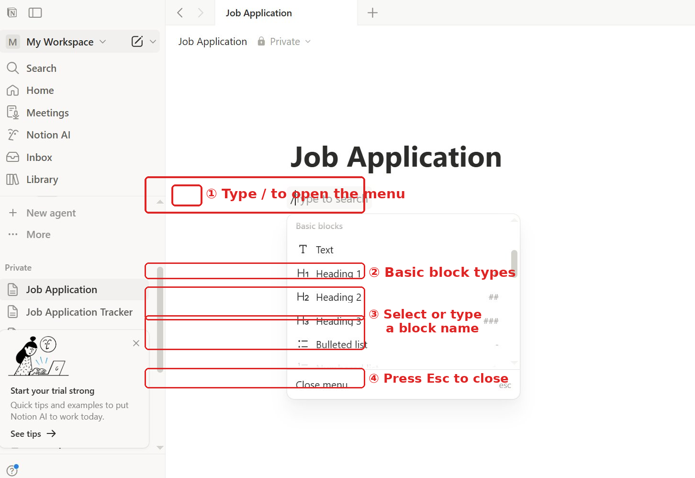
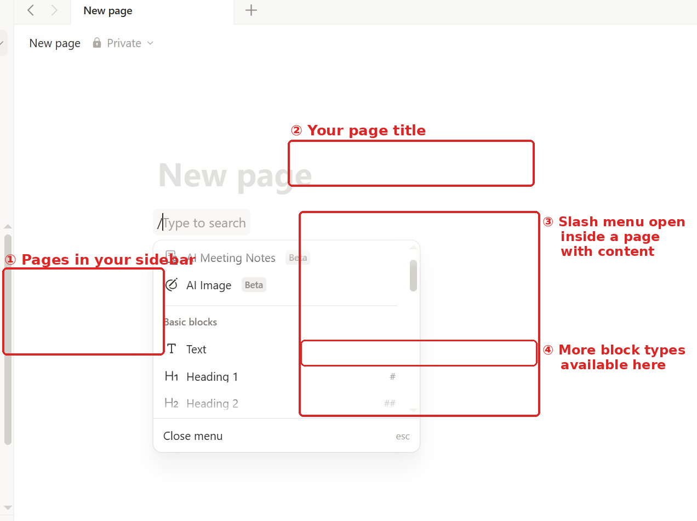
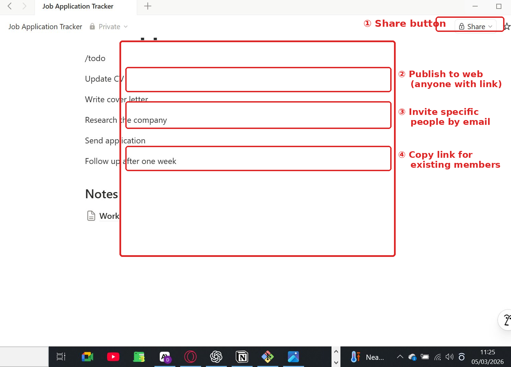

# Getting Started with Notion
**A beginner-friendly guide for first-time users**

---

## Overview

This guide is written for someone who has never used a dedicated productivity tool before — perhaps you have been managing work through emails, paper notes, or a basic spreadsheet, and want a better system.

Notion is an all-in-one workspace where you can write notes, manage tasks, organise projects, and collaborate with others — all in one place.

By the end of this guide, you will have:

- Created your first Notion workspace
- Built a simple project tracker for a real task
- Understood how to organise and share your work

> **Note:** This guide uses Notion's free plan. Everything described here is available without a paid subscription.

---

## 1. Creating Your Account

1. Go to [notion.so](https://www.notion.so)
2. Click **Sign up**
3. Enter your email address and follow the verification steps
4. When prompted, select **For myself** if you are using Notion alone, or **With my team** if you are setting it up for a group

Once verified, Notion will take you to your workspace dashboard — this is your home base for everything you create.

---

## 2. Understanding the Workspace

When you first open Notion, you will see three main areas:



**Sidebar (left panel)**
This is your navigation menu. It shows all your pages under the **Private** section, and gives you access to Search, Home, Settings, and more. Think of it like the folder structure on your computer — everything you create lives here.

**Main Editor (centre)**
This is where you write and build your pages. It works like a document editor, but with much more flexibility. You can mix text, lists, images, and tables freely on the same page.

**Top Bar**
Contains the page title, privacy settings, and the **Share** button. You will use Share when you are ready to collaborate with others or publish your work publicly.

---

## 3. Creating Your First Page

Pages are the building blocks of Notion. Everything you create — a note, a task list, a project tracker — lives inside a page.

**To create a page:**

1. Look at the sidebar on the left
2. Scroll down to the **Private** section
3. Click **+ New page** at the bottom of that section



4. A blank page will open in the main editor
5. Click on the title area and type a name — for example, *My First Project*
6. Press **Enter** and start typing your content

Your page is saved automatically as you type. You do not need to press a save button.

**What a page can contain:**
- Text and headings
- Images and files
- Task lists and checkboxes
- Tables and databases
- Links and subpages (pages nested inside other pages)

---

## 4. Adding Content with Blocks

Notion builds pages from **blocks** — individual units of content. Every paragraph, image, heading, and list item is its own block. This gives you the flexibility to rearrange, transform, and delete any piece of content independently.

**To add a new block:**

1. Click on any empty line in your page
2. Type `/` (forward slash) on your keyboard
3. A menu will appear showing all available block types



4. Type the name of the block you want, or scroll to find it
5. Click the block type or press **Enter** to add it

The menu also works inside a page that already has content — you can type `/` at the end of any line to insert a new block directly below it.



**Commonly used blocks:**

| Block type | What it does | How to add it |
|------------|--------------|---------------|
| Text | A standard paragraph | `/text` |
| Heading 1 | Large section title | `/h1` |
| Heading 2 | Subsection title | `/h2` |
| To-do list | Checkbox task | `/todo` |
| Bulleted list | Unordered list | `/bullet` |
| Table | Rows and columns | `/table` |
| Image | Upload or embed an image | `/image` |

> **Tip:** You can reorder any block by hovering over it. A six-dot handle (⠿) will appear on the left — click and drag it to move the block up or down the page.

---

## 5. Building a Simple Task Tracker

Let's put this into practice with a real example. Here is how to build a job application tracker — something immediately useful if you are currently applying for work.

**Step 1: Create a new page**
Click **+ New page** in the sidebar and name it *Job Application Tracker*.

**Step 2: Add your tasks**
Type `/todo` and press **Enter**. Add one task per line:

- [ ] Update CV
- [ ] Write cover letter
- [ ] Research the company
- [ ] Send application
- [ ] Follow up after one week

**Step 3: Add a notes section**
Type `/h2` to create a heading called *Notes*. Below it, add a text block for anything relevant — a contact name, the job URL, or the application deadline.

Here is what your page will look like as you build it:


Check off each task by clicking its checkbox as you complete it. Notion strikes through the text automatically to show it is done. Your finished tracker should look like the screenshot above.

---

## 6. Organising with Subpages

As your workspace grows, keeping everything listed flat in the sidebar becomes hard to navigate. Subpages let you nest pages inside other pages, creating a logical hierarchy.

**Example — before organising:**
All pages sit at the same level in the sidebar with no grouping. Finding a specific page means scrolling through everything.

**Example — after organising with subpages:**

```
Work
├── Job Applications
│   ├── Ventrata — Technical Writer
│   └── Company B — Content Writer
└── Portfolio Projects
    ├── Notion Guide
    └── Git Documentation
```

**To create a subpage:**

1. Open the parent page (e.g. *Work*)
2. Type `/page` on any empty line and press **Enter**
3. Name the new subpage
4. It will appear nested under the parent in your sidebar automatically

You can also drag existing pages into a parent by hovering over them in the sidebar and dragging them underneath another page.

---

## 7. Sharing Your Work

Notion makes it easy to share a page with someone else — for feedback, collaboration, or public viewing.

**To share a page:**

1. Open the page you want to share
2. Click **Share** in the top right corner
3. The sharing panel will open



4. Choose how you want to share:

| Option | What it means |
|--------|---------------|
| Invite by email | Share with a specific person — they will need a Notion account |
| Publish to web | Generate a public link anyone can open without an account |
| Copy link | Share with people who already have access to the page |

**Access levels you can assign:**

- **View** — the person can read but not change anything
- **Comment** — the person can leave notes without editing content
- **Edit** — the person can make changes to the page

> **Caution:** If you turn on **Publish to web**, anyone with the link can read the page. Only use this for content you are comfortable making public.

---

## 8. Using Templates

Notion includes pre-built templates so you do not have to start from scratch. Templates are useful when you know what you want to track but do not want to build the layout yourself.

**To use a template:**

1. Click **Templates** in the sidebar
2. Browse by category — Personal, Work, School, and more
3. Click a template to preview it
4. Click **Use this template** to add it to your workspace

**Useful templates for beginners:**

- **Simple To-Do List** — basic task management
- **Meeting Notes** — structured format for capturing decisions and actions
- **Personal Goals** — track progress over time
- **Project Tracker** — manage tasks across a project with status labels

You can customise any template after adding it — nothing is fixed or locked.

---

## Frequently Asked Questions

**What makes Notion different from Google Docs or Word?**
Google Docs and Word are primarily writing tools. Notion combines writing, task management, and database features in one place. A single Notion page can contain a document, a checklist, and a table — all connected and editable together.

**What happens if I accidentally delete a page?**
Deleted pages go to **Trash**, not gone permanently. Click **Trash** at the bottom of your sidebar to find and restore them. Pages stay in Trash for 30 days before being permanently removed.

**Can I use Notion offline?**
Notion has limited offline support. You can view recently opened pages, but creating new content or syncing changes requires an internet connection.

**Is the free plan enough to get started?**
Yes. The free plan includes unlimited pages, basic collaboration, and access to templates. Limits apply to file upload size and version history, but for a single user just getting started, the free plan is fully functional.

**How is a block different from a paragraph?**
A paragraph in a word processor is just text. A block in Notion is a self-contained unit — you can move it, transform it into a different type (turn a paragraph into a heading, or a heading into a to-do item), or delete it independently of everything else on the page.

**Can I import content from other tools?**
Yes. Notion supports importing from Evernote, Trello, Asana, Confluence, Google Docs, and plain Markdown files. Go to **Settings → Import** to get started.

---

## What to Explore Next

Once you are comfortable with the basics, these features are worth exploring:

- **Databases** — Notion's most powerful feature; build structured, filterable tables of information with different views
- **Linked databases** — display the same database in multiple places with different filters applied
- **Notion AI** — built-in assistant that can summarise, translate, and help draft content
- **Integrations** — connect Notion to tools like Slack, Google Calendar, and GitHub

---

*Written by Douglas Ebhoman — Technical Writer & Documentation Specialist*
*Part of the [Technical Writing Portfolio](https://github.com/Douglasebhoman) repository*
